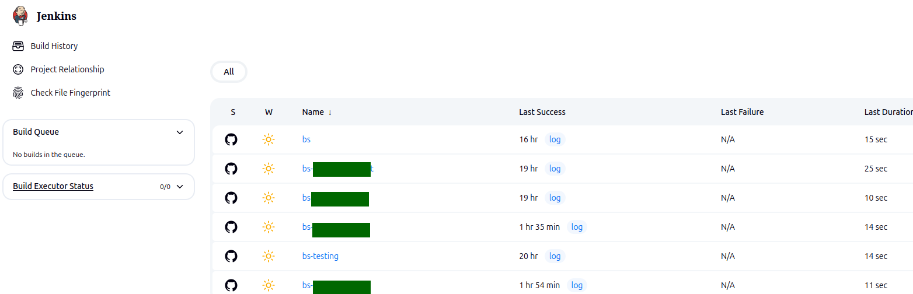
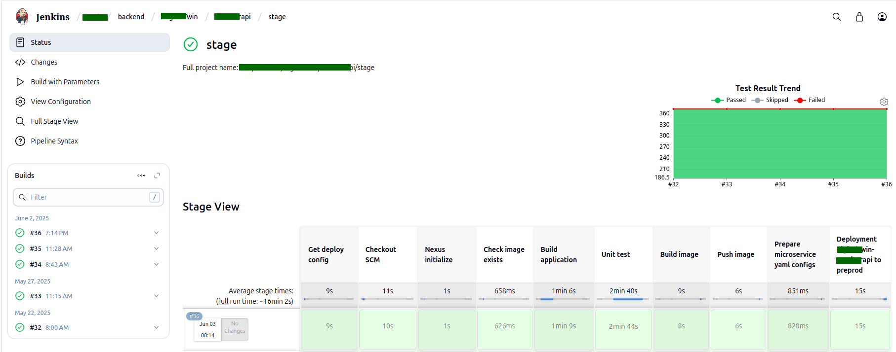

## Deploy to preprod
 

### Step 1: Open project in jenkins

 
 
 

### Step 2: Open `branch` in `project`

 
 
 

### Step 3: Checking the required `branch(1)` and set `preprod(3)`

 
 
 

### Step 4: Click to `Build`

 
 
 

### Step 5: Wait to finish `build`
