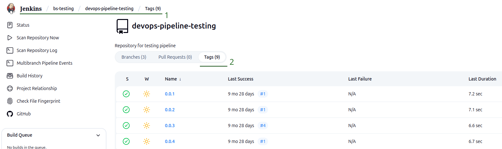

## Deploy to prod
 

### Step 1: Open project in jenkins

 
 
 

### Step 2: Open `branch`(*master*) in `project`

 
 
 

### Step 3: Checking the required `branch(1)`(*master*) and choose `Release Type(2)`

 
 
 

### Step 4: Click to `Build`

 
 
 

### Step 5: Wait to finish `build` make release

 
 
 

### Step 6: Go to(1) the `tags` tab(2)

 
 
 

### Step 7: Checking the required `branch(1)` and set `prod(2)`

 
 
 

### Step 8: Wait to finish `build` prod
