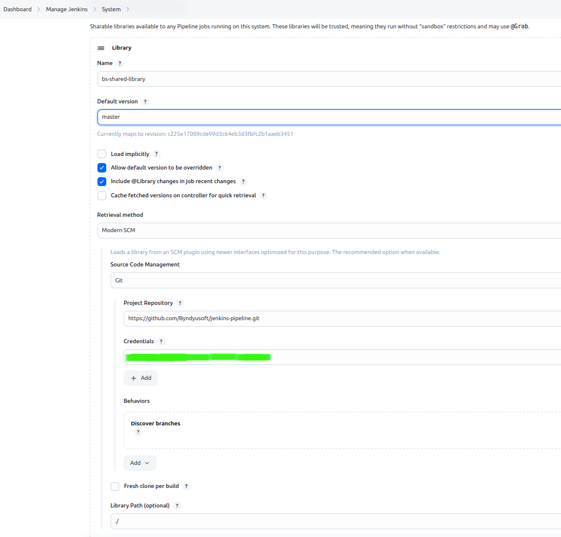

# Installation

## Docs
- Full instruction: https://www.jenkins.io/doc/book/pipeline/shared-libraries/

## Connect share lib to jenkins:
1. Create creds in jenkins for github
2. In `Manage Jenkins > Configure System > Global Pipeline Libraries` set shared library name, version, url and creds.
   
3. Connecting library in your pipeline
```groovy
@Library(['bs-shared-library']) _
```
4. [Documents pipeline](settings/README.md)

## Install plugins to jenkins:
1. In `Manage Jenkins > Plugins`
```
- ansicolor
- antisamy-markup-formatter
- bootstrap5-api
- checks-api
- command-launcher
- commons-lang3-api
- configuration-as-code
- docker-commons
- docker-workflow
- echarts-api
- font-awesome-api
- git
- git-server
- github
- github-api
- github-branch-source
- javax-mail-api
- jdk-tool
- jjwt-api
- jquery3-api
- junit
- kubernetes
- lockable-resources
- matrix-auth
- oauth-credentials
- oic-auth
- okhttp-api
- pipeline-graph-analysis
- pipeline-rest-api
- pipeline-stage-view
- pipeline-utility-steps
- plugin-util-api
- sonar
- thinBackup
- timestamper
- token-macro
- workflow-aggregator
- workflow-api
- workflow-step-api
- ws-cleanup
- folder-properties
- uno-choice
```