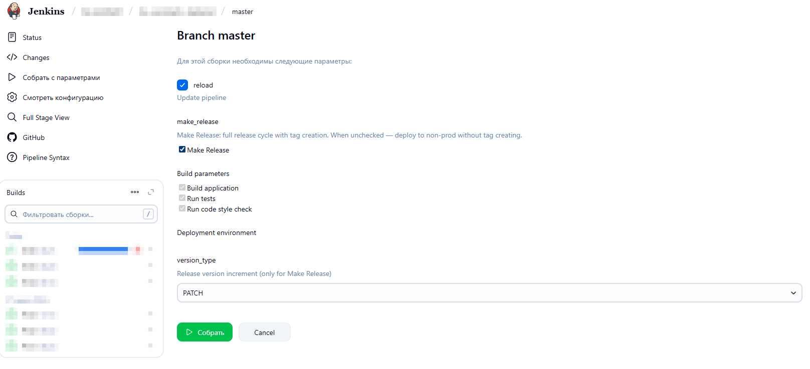
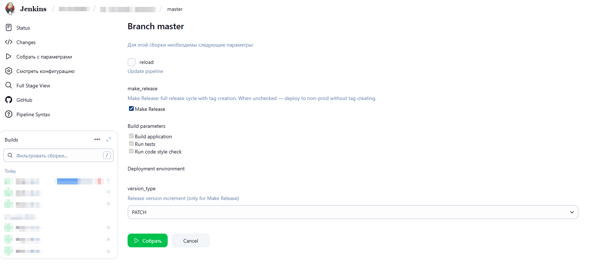
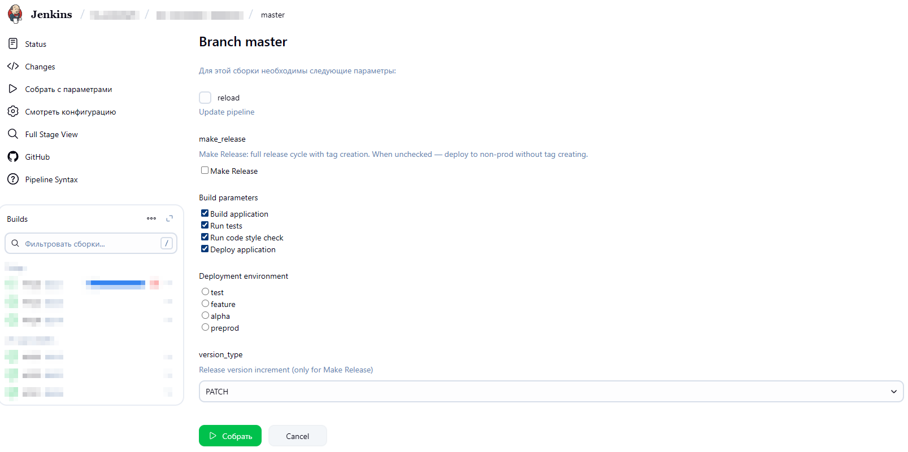

# Master Branch UI Modes

On the `master` branch, the Jenkins UI dynamically changes based on your selection to ensure a safe and predictable workflow.

 

## Option 1: Pipeline Logic Update (Reload)
Use this when you only need to update the pipeline script without running a build.

### Step 1: Check the `reload` checkbox
Checking this hides all other functional parameters to prevent accidental execution.

 
 

## Option 2: Full Release Cycle (Make Release)
Use this for official versioning and deployment to the pre-production environment.

### Step 1: Ensure `reload` is unchecked and check `Make Release`
"Build parameters" and "Deployment environment" are automatically hidden. The pipeline will follow a predefined sequence: Test -> Build -> Tag -> Preprod.

### Step 2: Choose the `version_type`
Select how to increment the version (PATCH, MINOR, or MAJOR) before clicking **Build**.
 
 

## Option 3: Manual Build / Preview Mode
Use this for testing master code or deploying to specific non-prod environments without creating a Git tag.

### Step 1: Ensure both `reload` and `Make Release` are unchecked
This reveals the manual configuration options.

### Step 2: Select required stages and environment
* **Build parameters**: Manually choose which stages to run (e.g., skip tests if necessary).
* **Deployment environment**: Choose the target environment (e.g., `test`, `feature`, `alpha`).
 
 

---
> **Note**: If the UI doesn't look as expected, ensure that the `reload` and `make_release` checkboxes are in the correct state for your specific task.